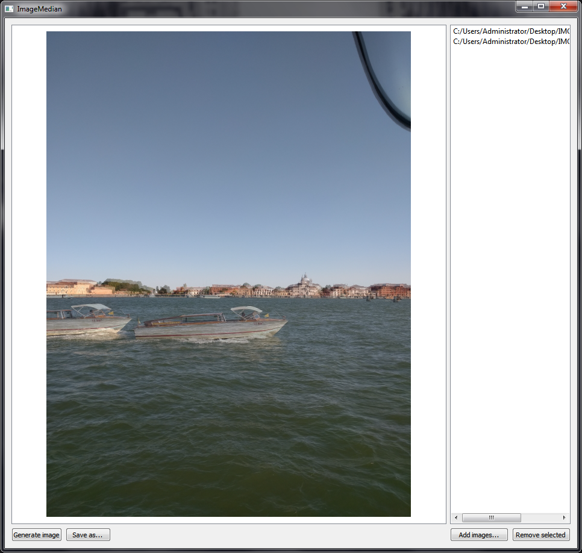

# ImageMedian
A tool for creating a composite image, or reducing noise by combining multiple images of the same scene. Written in Qt/C++.

## Download

Download link: [Win32 binary](https://github.com/Extender/ImageMedian/raw/master/bin/imagemedian-v1.0-bin-win32.zip)

## Screenshot

